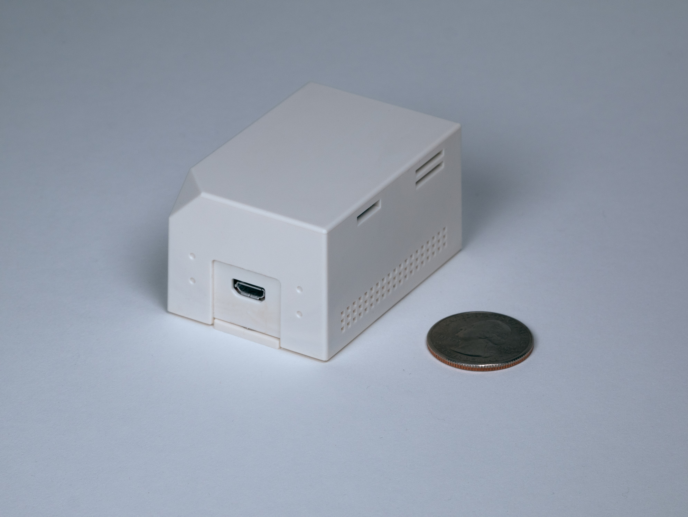

# COLLECTION-model4841

[](https://github.com/mcci-catena/COLLECTION-model4841/releases/latest) [](https://github.com/mcci-catena/COLLECTION-model4841/compare/v1.3.2...master)

Sources and required libraries for the MCCI&reg; [Model 4841 Air Quality Sensor](https://mcci.io/buy-model4841).

[](https://mcci.io/buy-model4841)

This repo is mostly submodules; clone it using `git clone --recursive`.

The script [`build-with-cli.sh`](build-with-cli.sh) can be used to build the `model4841-production-lorawan` sketch using the [`arduino-cli`](https://github.com/arduino/arduino-cli).

This corresponds to MCCI document 234001363.

To build:

1. Clone this repository:

    ```bash
    git clone --recursive git@github.com:mcci-catena/COLLECTION-model4841.git
    ```

2. If building with a project secure key, get a copy of that key and put it someplace handy; please make sure it's password protected, at least.

3. Build with the following commands:

    - to build with the test-signing key:

      ```bash
      ./build-with-cli --test
      ```

    - to build with a project-specific key:

      ```bash
      ./build-with-cli --key={path-to-file}.pem
      ```

    - to build for 32 MHz clock, for Europe, with the test-signing key:

      ```bash
      ./build-with-cli.sh --clock=32 --region=eu868 --test
      ```

    - to build for multiple regions and multiple networks:

      ```bash
      ./build-with-cli.sh --test --verbose && ./build-with-cli.sh --test --verbose --region=au915 --network=ttn && ./build-with-cli.sh --test --verbose --region=eu868 --network=ttn
      ```

   The output shows up in `{slug}/build/ide`, where `{slug}` represents the sketch and key configuration options.

---

## Meta

### Trademarks and copyright

MCCI and MCCI Catena are registered trademarks of MCCI Corporation. LoRa is a registered trademark of Semtech Corporation. LoRaWAN is a registered trademark of the LoRa Alliance.

This document and the contents of this repository are copyright 2021-2022, MCCI Corporation.

### License

[This repository]() is released under the [MIT](./LICENSE.md) license. Commercial licenses are also available from MCCI Corporation.

### Support Open Source Hardware and Software

MCCI invests time and resources providing this open source code, please support MCCI and open-source hardware by purchasing products from MCCI, Adafruit and other open-source hardware/software vendors!

For information about MCCI's products, please visit [store.mcci.com](https://store.mcci.com/).
